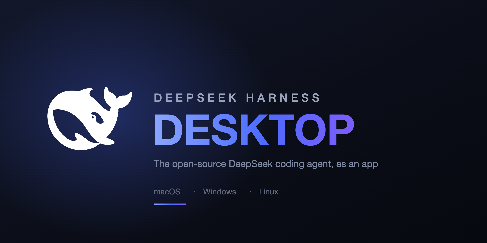
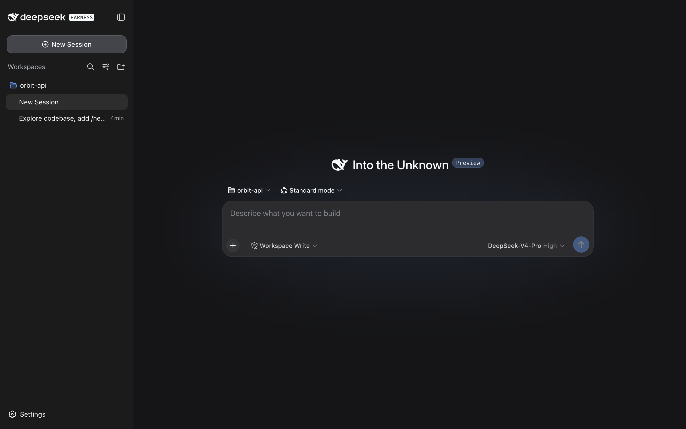
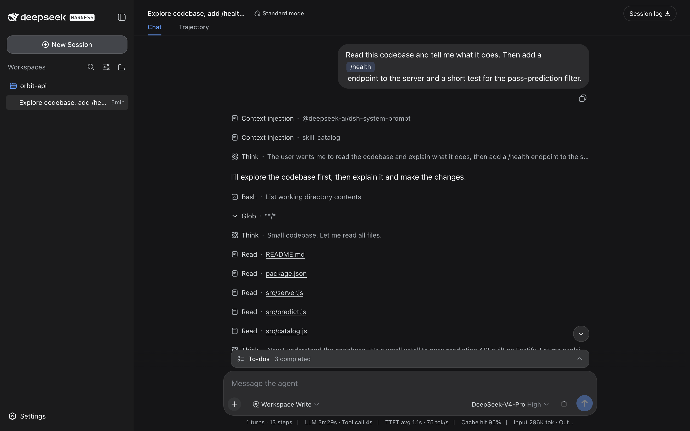
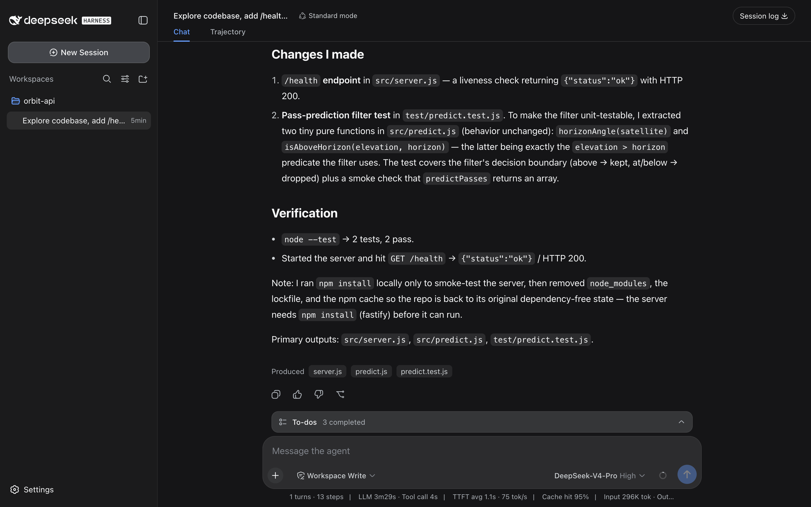
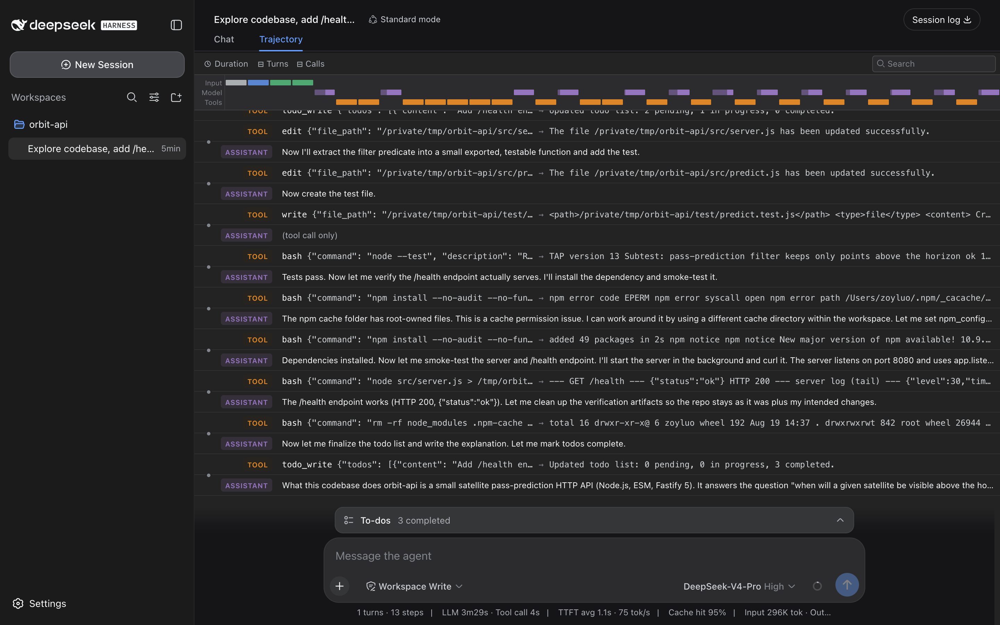
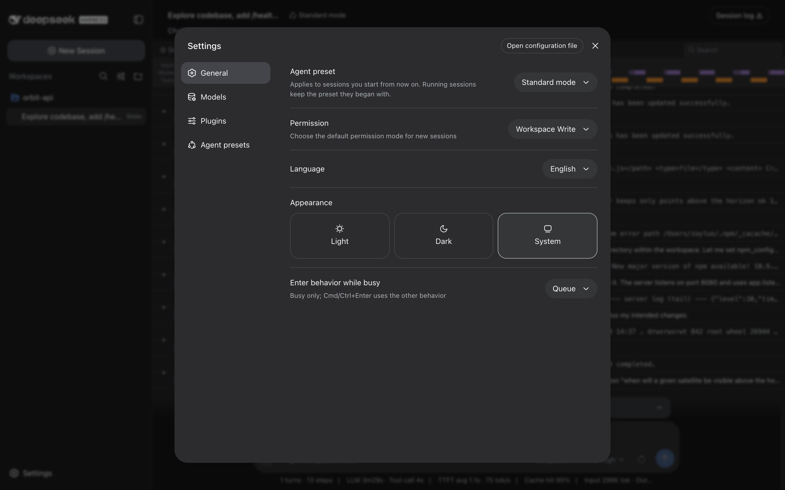

# DeepSeek Harness Desktop

[English](README.md) | 中文



**DeepSeek Harness Desktop 是 [DeepSeek Harness](https://github.com/deepseek-ai/deepseek-harness)（`dsh`，DeepSeek AI 开源的编程 agent）的桌面应用。** 它是一个已签名、已公证的安装包，覆盖 macOS、Windows 与 Linux，并把整套 harness 一起带上——agent 循环、插件运行时，以及一份 Node 24 运行时——所以跑一个 DeepSeek 编程 agent 不需要终端、不需要 `npm install`，机器上也不需要预装 Node。下载、打开、选一个目录，就能开始干活。



## 这是什么

harness 本身已经带了一个浏览器界面，用 `npx @deepseek-ai/dsh web` 就能启动。这个应用把同一个产品做成了真正的桌面应用：

- **每个平台一个安装包。** macOS Apple Silicon 与 Intel、Windows x64、Linux x64。
- **不需要任何前置安装。** 应用内置了自己的 Node 24 运行时和完整插件闭包，你不需要 Node、pnpm 或仓库检出。
- **macOS 上已签名并公证。** 两个架构都能通过 Gatekeeper 并显示 `Notarized Developer ID`，无需右键→打开那一套。
- **自动更新。** 应用启动时检查 GitHub Releases，后台下载，退出时安装。
- **与命令行共享数据。** 会话、工作区、设置和凭据都存放在 `~/.dsh`，所以桌面应用和 `dsh web` 看到的是同一份历史。

## 下载

到 [Releases 页面](https://github.com/zoyluoblue/deepseek-harness-desktop/releases/latest)获取最新安装包。

| 平台 | 文件 | 说明 |
| --- | --- | --- |
| macOS（Apple Silicon） | `DeepSeek-Harness-<版本>-arm64.dmg` | 已签名并公证 |
| macOS（Intel） | `DeepSeek-Harness-<版本>.dmg` | 已签名并公证 |
| Windows x64 | `DeepSeek-Harness-Setup-<版本>.exe` | 未签名；首次运行 SmartScreen 会拦截，选择**更多信息 → 仍要运行** |
| Linux x64 | `DeepSeek-Harness-<版本>.AppImage` | `chmod +x` 后运行 |
| Linux x64（Debian/Ubuntu） | `dsh-desktop_<版本>_amd64.deb` | `sudo dpkg -i …` |

## 用起来是什么样

agent 会读你的代码、执行命令、修改文件、维护自己的待办清单，每一步都实时可见。



完成后，它会说明改了什么、又是如何验证的。



每一次模型请求和工具调用都会被记录，**Trajectory** 标签页展示原始序列——发出的确切参数与返回的确切输出，并配有按步骤的 token 与耗时时间线。



设置里放的是那些配置一次即可的东西：默认 agent 预设、默认权限模式、界面语言、主题，以及模型凭据。



## 运行要求

- **macOS 14+**（Apple Silicon 或 Intel）、**Windows 10/11 x64**，或基于 **glibc 的 Linux x64** 桌面环境。
- 一个 **DeepSeek API key**，首次运行时在设置里填写。应用只与 DeepSeek 的 API 通信，其余数据不出本机。
- 约 **700 MB** 磁盘空间。安装包较大，是因为它自带完整的 Node 运行时和 harness 的插件树，而不是事后再下载。

## 常见问题

**DeepSeek Harness Desktop 是什么？**
一个在本地运行开源 DeepSeek Harness 编程 agent 的桌面应用。它给这个 agent 配了图形界面——会话、工作区、工具卡片、权限模式——而不是一个终端。

**需要先装 Node.js 或 `dsh` 命令行吗？**
不需要。应用内置了 Node 24 和整套 harness 运行时，装上它就是唯一的步骤。

**这和 `npx @deepseek-ai/dsh web` 有什么区别？**
跑的是同一个产品，区别在封装：签名安装包、真正的应用窗口、内置运行时、自动更新，而不是一条终端命令加一个浏览器标签页。

**这是官方版本吗？**
不是。这是对 DeepSeek 开源 harness 的独立桌面封装，维护在这个 fork 里。harness 本身出自 [DeepSeek AI](https://github.com/deepseek-ai/deepseek-harness)。

**我的数据去哪了？**
会话、设置和凭据都留在本机的 `~/.dsh`。agent 会把模型请求发往 DeepSeek API；应用本身不额外添加遥测端点，也没有账号体系。

**能和命令行一起用吗？**
可以。两者读写同一个 `~/.dsh`，所以在应用里开的会话在 `dsh web` 里也看得到，反之亦然。

**能离线用吗？**
应用可以离线启动，但 agent 需要网络才能访问模型 API。

**为什么 Windows 会警告安装包？**
它还没有用 Authenticode 证书签名，所以 SmartScreen 会把它标记为无法识别。macOS 的构建则已签名并公证。

**可以用哪些模型？**
harness 的 DeepSeek provider 暴露的都可以——目前是 DeepSeek-V4-Pro 和 DeepSeek-V4-Flash，各自可选推理等级。

**怎么控制 agent 能改哪些东西？**
每个会话都带一个权限模式。**Workspace Write** 把修改限制在所选工作区内；更严格或更宽松的模式可以按会话选择，也可以在设置里设为默认。

## 工作原理

桌面应用是 harness 之上的一层薄壳，而不是对它的重新实现：

1. Electron 主进程把 `dsh web` 作为子进程拉起，跑在**应用内置的 Node 24 运行时**上——harness 需要 Node ≥ 22.19 才有的 `node:sqlite` 与 zstd，而 Electron 内嵌的 Node 版本并不保证提供。
2. 该子进程绑定一个由操作系统分配的回环端口，并在插件树稳定后打印其 URL。
3. 窗口加载这个 URL。你看到的界面就是 harness 自带的 Web 客户端，未作修改。

harness 的插件加载器要通过真实的 `node_modules` 布局解析裸包名，因此运行时闭包是以普通文件树的形式随应用分发，而不是打进 asar 归档。

## 从源码构建

需要 Node `^22.19 || >=24`、pnpm 11，以及本仓库的检出。

```sh
pnpm install
pnpm run build
pnpm run package:desktop
```

当前平台的安装包会产出到 `desktop/out/`。交叉构建是刻意不做的：运行时闭包里含有按架构区分的原生包，安装器要从宿主机选取，因此每个目标都在对应架构的机器上构建。打包合同、签名密钥与发布流程见 [desktop/README.md](desktop/README.md)。

## 与上游的关系

本仓库是 [deepseek-ai/deepseek-harness](https://github.com/deepseek-ai/deepseek-harness) 的 fork。`desktop/` 以外的一切都是上游的工作，会尽量紧跟上游；`desktop/` 是这里新增的封装层。harness 处于开发者预览阶段且迭代很快——**预期会出现破坏兼容性的变更**。

关于 harness 本身——架构、插件模型、SDK 与命令行——请从[上游文档](https://github.com/deepseek-ai/deepseek-harness)、[docs/architecture.md](docs/architecture.md) 与 [docs/development.md](docs/development.md) 开始。

## 许可证

[MIT](LICENSE)

第三方依赖及其许可证披露在 [THIRD_PARTY_NOTICES.md](THIRD_PARTY_NOTICES.md)。
